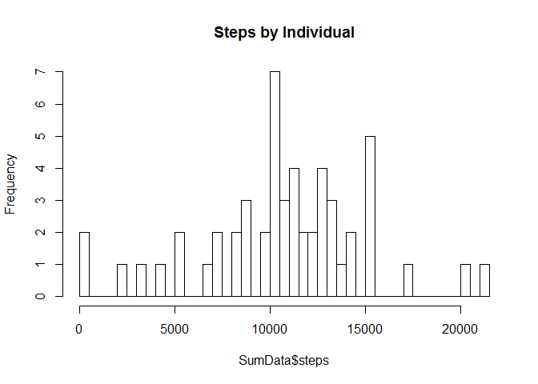
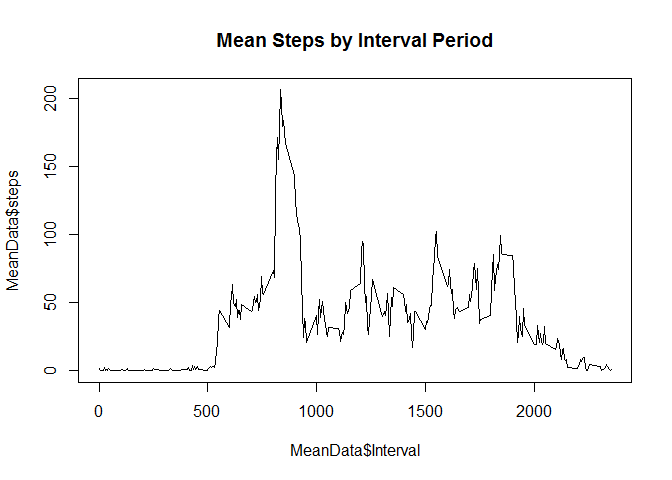
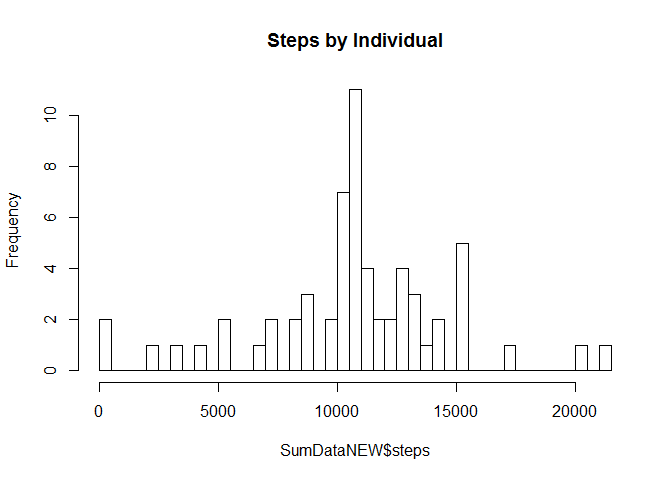
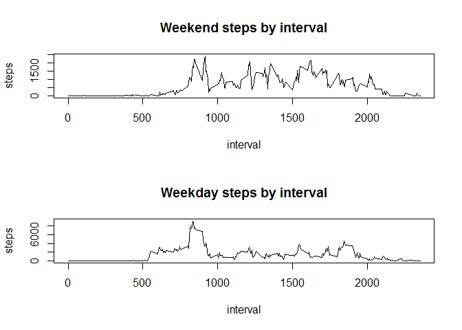

# Project 1 Reproducible Research


## PART 1 Loading and preprocessing the data


```r
Data<-read.csv("activity.csv")
DataClean<-na.omit(Data)
library(plyr)
summary(DataClean)
```

```
##      steps                date          interval     
##  Min.   :  0.00   2012-10-02:  288   Min.   :   0.0  
##  1st Qu.:  0.00   2012-10-03:  288   1st Qu.: 588.8  
##  Median :  0.00   2012-10-04:  288   Median :1177.5  
##  Mean   : 37.38   2012-10-05:  288   Mean   :1177.5  
##  3rd Qu.: 12.00   2012-10-06:  288   3rd Qu.:1766.2  
##  Max.   :806.00   2012-10-07:  288   Max.   :2355.0  
##                   (Other)   :13536
```
Note that all NAs were removed but we still have zero min quantity

## Part II What is mean total number of steps taken per day?

Histogram of the total number of steps the individuals in our data set 

```r
SumData<-aggregate(DataClean["steps"],list(date = DataClean$date),sum)
hist(SumData$steps, breaks=50, main="Steps by Individual")
```

<!-- -->

```r
summary(SumData)
```

```
##          date        steps      
##  2012-10-02: 1   Min.   :   41  
##  2012-10-03: 1   1st Qu.: 8841  
##  2012-10-04: 1   Median :10765  
##  2012-10-05: 1   Mean   :10766  
##  2012-10-06: 1   3rd Qu.:13294  
##  2012-10-07: 1   Max.   :21194  
##  (Other)   :47
```
Note the mean and median from the summary taken on the data set

## Part III What is the average daily activity pattern?

Plot of the Daily Steps Taken (in 5 Minute intervals) 

```r
MeanData<-aggregate(DataClean["steps"],list(Interval = DataClean$interval),mean)
plot(MeanData$Interval, MeanData$steps, type ="l", main= "Mean Steps by Interval Period")
```

<!-- -->

```r
summary(MeanData)
```

```
##     Interval          steps        
##  Min.   :   0.0   Min.   :  0.000  
##  1st Qu.: 588.8   1st Qu.:  2.486  
##  Median :1177.5   Median : 34.113  
##  Mean   :1177.5   Mean   : 37.383  
##  3rd Qu.:1766.2   3rd Qu.: 52.835  
##  Max.   :2355.0   Max.   :206.170
```
See summary above for max interval of 2355

## Part IV Imputing missing values

How many values of NA do I have in my original Dataset?

```r
StepsNA<-sum(is.na(Data$steps))
DataNA<-sum(is.na(Data$date))
IntervalNA<-sum(is.na(Data$interval))
```

There are 2304 rows containing an NA value, all of which are the the Steps column


```r
## First append DataMean to Data based on matching interval
Data$match<-MeanData$steps[match(Data$interval,MeanData$Interval)]
## Then conditionally index the Data Frame and replace all NA in step column 1 with match column 4
Index<-is.na(Data$steps)
Data$steps[Index]<-Data$match[Index]
##Verify NA's have been replaced by running sum(is.na(Data$Steps))
SumDataNEW<-aggregate(Data["steps"],list(date = Data$date),sum)
hist(SumDataNEW$steps, breaks=50, main="Steps by Individual")
```

<!-- -->

```r
summary(SumDataNEW)
```

```
##          date        steps      
##  2012-10-01: 1   Min.   :   41  
##  2012-10-02: 1   1st Qu.: 9819  
##  2012-10-03: 1   Median :10766  
##  2012-10-04: 1   Mean   :10766  
##  2012-10-05: 1   3rd Qu.:12811  
##  2012-10-06: 1   Max.   :21194  
##  (Other)   :55
```

```r
summary(SumData)
```

```
##          date        steps      
##  2012-10-02: 1   Min.   :   41  
##  2012-10-03: 1   1st Qu.: 8841  
##  2012-10-04: 1   Median :10765  
##  2012-10-05: 1   Mean   :10766  
##  2012-10-06: 1   3rd Qu.:13294  
##  2012-10-07: 1   Max.   :21194  
##  (Other)   :47
```

When comparing the mean and median of the old data set and the new data set, per the summary of each, the totals work out to be the same.
The impact is in the quantile data and in the total number of records

## Part V Are there differences in activity patterns between weekdays and weekends?


```r
## Make sure your date column changes from a 'factor' class to a 'date' class
DataClean$date<-as.Date(DataClean$date)
## Add new factor column using weekdays() function
DataClean$Weekdata<-weekdays(DataClean$date)
## Add Another factor column to state whether the day is a weekend or weekday
DataClean$Day_or_End<- ifelse(DataClean$Weekdata == "Saturday" | DataClean$Weekdata == "Sunday", "Weekend", "Weekday")
##Final Aggregate data to plot
FinalAGG<-aggregate(steps ~ interval + Day_or_End, DataClean, sum)
attach(FinalAGG)
par(mfrow=c(2,1))
plot(subset(FinalAGG, Day_or_End == "Weekend", select=c("interval","steps")), type="l", main="Weekend steps by interval")
plot(subset(FinalAGG, Day_or_End == "Weekday", select=c("interval","steps")), type="l", main="Weekday steps by interval")
```

<!-- -->
knit2html()
